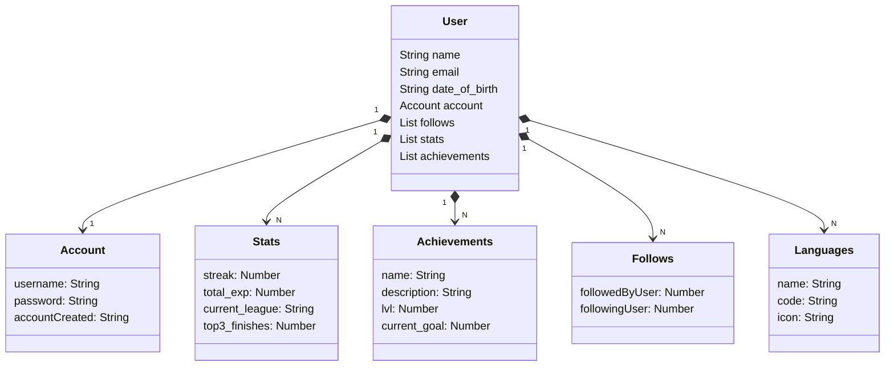

# Dio Santander Dev Springboot challenge 

## Projeto: API Restful Springboot com padrões de projeto

### Diagrama de classes 

```mermaid
classDiagram
  class User {
    String name
    String email
    String date_of_birth
    Account account
    List<follows> follows
    List<Stats> stats
    List<Achievements> achievements
  }

  class Account {
    username: String
    password: String
    accountCreated: String
  }

  class Stats {
    streak: Number
    total_exp: Number
    current_league: String
    top3_finishes: Number
  }

  class Achievements {
    name: String
    description: String
    lvl: Number
    current_goal: Number
  }

  class Follows {
    followedByUser: Number 
    followingUser: Number
  }

  class Languages {
    name: String
    code: String
    icon: String
  }

  User "1" *--> "1" Account
  User "1" *--> "N" Stats
  User "1" *--> "N" Achievements
  User "1" *--> "N" Follows
  User "1" *--> "N" Languages


```